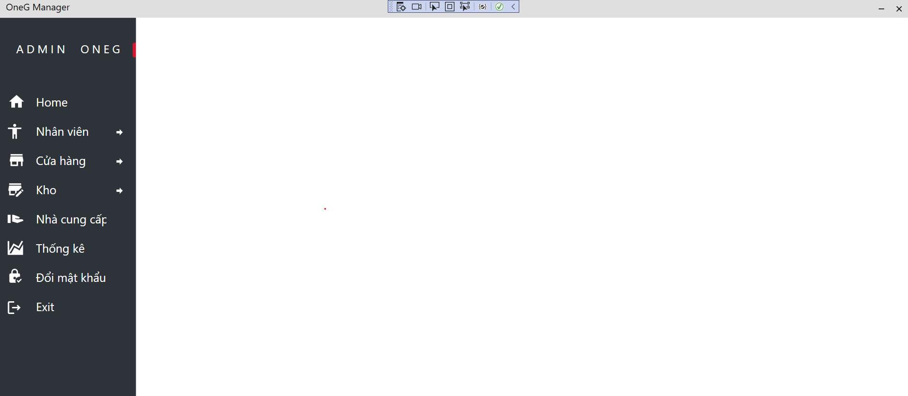
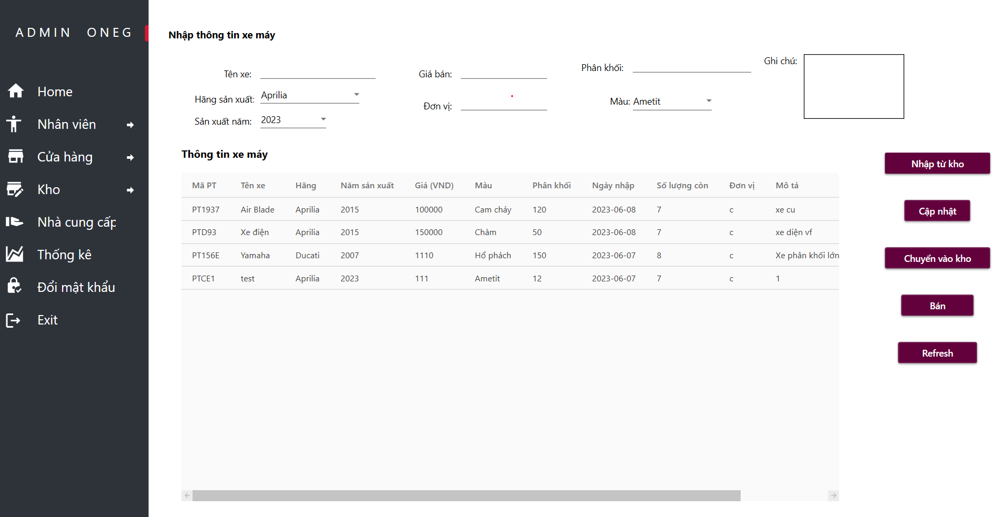

<h2>Học phần: Thực tập chuyên ngành kỹ thuật phần mềm</h2>
 

Đề tài: Xây dựng phần mềm quản lý phương tiện giao thông bằng .NET 6 WPF Application

Các chức năng chính của admin và nhân viên:

<ul>
  <li>Đăng nhập</li>
  <li><b>Admin:</b> Quản lý nhân viên</li>
  <li>Quản lý xe máy</li>
  <li>Quản lý xe tải</li>
  <li>Quản lý xe oto</li>
  <li>Quản lý kho xe máy</li>
  <li>Quản lý kho xe tải</li>
  <li>Quản lý kho xe oto</li>
  <li>Thống kê nhập hàng</li>
</ul>

<h3> <b>1. Giao diện đăng nhập</b></h3>

<h3> <b>2. Giao diện chính admin và nhân viên có chức năng tương ứng</b></h3>

<h3> <b>3. Giao diện quản lý nhân viên</b></h3>

<h3> <b>4. Giao diện quản lý nhân viên trong kho</b></h3>

<h3> <b>5. Giao diện quản lý xe máy</b></h3>

<h3> <b>6. Giao diện quản lý xe tải</b></h3>

<h3> <b>7. Giao diện quản lý xe oto</b></h3>

<h3> <b>8. Giao diện quản lý kho xe máy</b></h3>

<h3> <b>9. Giao diện quản lý kho xe tải</b></h3>

<h3> <b>10. Giao diện quản lý kho xe oto</b></h3>

<h3> <b>11. Giao diện nhà cung cấp</b></h3>

<h3> <b>12. Giao diện thống kê phiếu nhập kho hàng</b></h3>

<h3> <b>13. Mẫu File thống kê nhập hàng</b></h3>

<h3> <b>14. Mẫu File hóa đơn bán hàng</b></h3>

<h3> <b>15. Giao diện đổi mật khẩu</b></h3>

